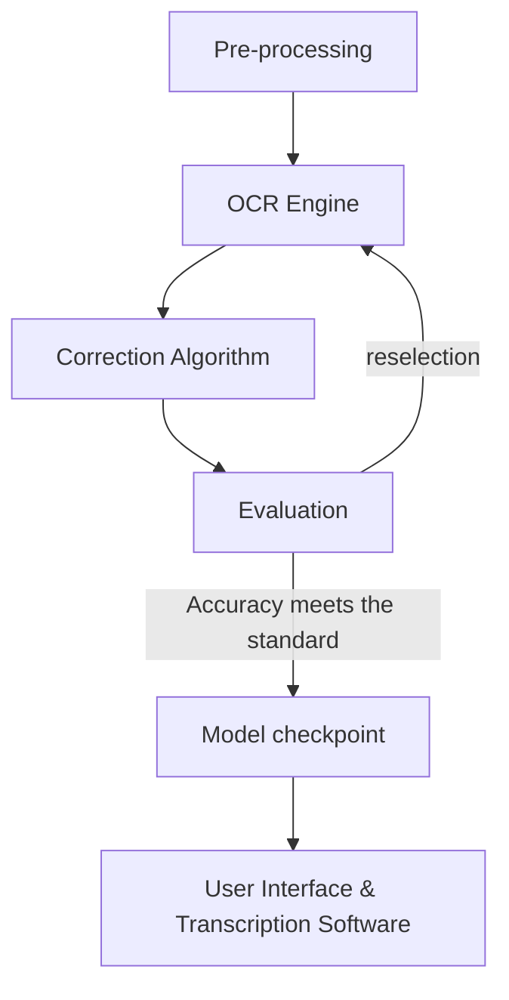
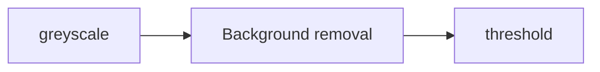
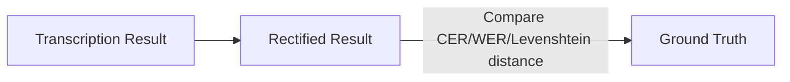

# Data+ 2022: AI-powered Historical Text Transcription

## Introduction

David M. Rubenstein Rare Book and Manuscript Library at Duke University holds millions of pages of handwritten documents ranging from ancient Papyri to records of Southern plantations to 21st century letters and diaries. Only a small subset of these documents have been digitized and made available online, and even fewer have been transcribed. The lack of text transcripts for handwritten documents impairs discovery and use of the materials, and prohibits any kind of computational text analysis that might support new avenues of research, including research related to the histories of racial injustice.
  
  While Optical Character Recognition (OCR) technology has made it possible to derive machine-readable text from typewritten documents in an automated way for several decades, the work of transcribing handwritten documents remains largely manual and labor-intensive. In the last few years, however, platforms like Transkribus have sought to harness the power of machine-learning by using Handwriting Text Recognition (HTR) to extract text from manuscripts and other handwritten documents held in libraries and archives. To date, the Rubenstein Library has conducted a few small-scale HTR experiments with mixed (and mostly disappointing) results. We have a lot to learn about the viability of HTR for our collections and about how to incorporate HTR into our existing workflows.
  
  In this Data+ project, students will test the viability of AI-powered HTR for transcribing digitized handwritten documents in the Rubenstein library and make recommendations for how the library might incorporate HTR into existing workflows, projects, and interfaces. Source material will be drawn from the Duke Digital Collections and will initially focus on a subset of digitized 19th-20th century [women’s travel diaries](http://repository.duke.edu/dc/womenstraveldiaries). 


## Machine-Learning Pipelines

Sample Workflow: 



Initially, we choose five mainstream OCR engines developed by renowned tech companies, which already generate satisfying results on transcribing printed text. Covering most of the transcription industry, these engines are Transkribus, Tesseract (from HP & Google), Kraken, Google Cloud Vision, and Amazon AWS Textract. These engines are relatively mature, leaving space for future development and training. Obviously, there are still a few OCR engines available out in the internet, like Ocular(from University of California, Berkeley), but they have been proved not suitable for this task of written historical text transcription. 

## Pre-processing




```
def get_greyscale(image):
    return cv2.cvtColor(image, cv2.COLOR_BGR2GRAY)  
    #change the image from RGB color to a single channel grey scale, which transform the image into more printed-text style, and definitely increase accuracy

def remove_noise(image):
    return cv2.bilateralFilter(image, 5, 75, 75)    #remove background noises

def thresholding(image):
    return cv2.adaptiveThreshold(image, 255, cv2.ADAPTIVE_THRESH_GAUSSIAN_C, cv2.THRESH_BINARY, 15, 9)  
    #further remove all the useless information in the background other than handwriting
```


## Symspell Algorithm

SymsSpell is an algorithm used for Post-OCR correction, whose principle is to find all strings in very short time within a fixed edit distance from a large list of strings. SymSpell derives its speed from the Symmetric Delete spelling correction algorithm and keeps its memory requirement in check by prefix indexing. The Symmetric Delete spelling correction algorithm reduces the difficulty of the generation of edit candidates and the dictionary quest for the difference in distance. It is six orders of magnitude faster(than the traditional method with deletes + transposes + substitutes + inserts) and language independent.




```
sym_spell = SymSpell(max_dictionary_edit_distance=2, prefix_length=7)
dictionary_path = pkg_resources.resource_filename(
    "symspellpy", "frequency_dictionary_en_82_765.txt"
)
bigram_path = pkg_resources.resource_filename(
    "symspellpy", "frequency_bigramdictionary_en_243_342.txt"
)
# term_index is the column of the term and count_index is the
# column of the term frequency
sym_spell.load_dictionary(dictionary_path, term_index=0, count_index=1)
sym_spell.load_bigram_dictionary(bigram_path, term_index=0, count_index=2)

# lookup suggestions for multi-word input strings (supports compound
# splitting & merging)
file = open(r"")
content = file.read()

# max edit distance per lookup (per single word, not per whole input string)
suggestions = sym_spell.lookup_compound(content, max_edit_distance=2, transfer_casing=True)

result_after = ""
# display suggestion term, edit distance, and term frequency
for suggestion in suggestions:
    result_after += suggestion.term
```

```
Example:

Can yu readthis messa ge despite thehori    can you read this message despite the ho
ble sppelingmsitakes                        rrible spelling mistakes

```


## Five Available OCR Engine


The data for kraken in this graph is a mere estimation. We estimate that give an approprite training set, Kraken can reach an accuracy of 85%. Sampling Kraken projects can be found online. 

 
## Transkribus

### Introducton

  Transkribus is a comprehensive platform for the digitisation, AI-powered text recognition, transcription and searching of historical documents – from any place, any time, and in any language. Visit the official [Transkribus](https://readcoop.eu/transkribus/?sc=Transkribus) website here. 

Strength
- extremely high accuracy in cursive hand written text recognition
- commercial product with mature software available
- support both printed text(Pylaia engine: Transkribus Print M1 model) and hand written text in all languages (HTR engine: e.g. Transkribus English Handwriting M3). 
- trainable using labeled pages, the feasibility is still remain to be tested.

Weakness
- Low generalizability
- Not open-sourced, not replicable
- Transkribus requires credits to process large-scale transcription (16€ for 120 credits). 


### DataSet & Accuracy

| Training Set for Transkribus English Handwriting M3 | [Jeremy Bentham Project](https://www.ucl.ac.uk/bentham-project/) |
| Testing Set | Women‘s Travel Diaries | 
| Accuracy w/ symspell algorithm | CER:  1.84, WER:  5.56, Levenshtein distance:  96 [^2] |
| Accuracy w symspell algorithm | CER:  7.88, WER:  12.74, Levenshtein distance:  92 |

[^2]: The current lowest CER produced by the general HTR tool (support more than cursive handwriting) in the industry is around 2.75%.


## Tesseract

### Introducton

  Tesseract was originally developed at Hewlett-Packard Laboratories Bristol and at Hewlett-Packard Co, Greeley Colorado between 1985 and 1994, with some more changes made in 1996 to port to Windows, and some C++izing in 1998. In 2005 Tesseract was open sourced by HP. From 2006 until November 2018 it was developed by Google. Visit [Tesseract](https://github.com/tesseract-ocr/tesseract) repository here.

Strength
- Extremely high accuracy in recognizing a majority of printed fonts
- Various line segmentation & Recognition mode
- High Generalizability
- Tesseract comes with a python wrapper class called [Pytesseract](https://pypi.org/project/pytesseract/)
- Support training

Weakness
- extremely tenuous training process (using shell scripts), nearly inable to train
- training is based on lines (segemented files paired up with ground-truth)
- Inable to recognize cursive fonts, accuracy changes correspondent with cursiveness. 
- Low accuracy in transcribing vowels, especially a & e

### DataSet & Accuracy

| Training Set | [tessdata_fast & tessdata_best](https://github.com/tesseract-ocr/tessdata) This repository contains the best trained data for the Tesseract Open Source OCR Engine.|
| Testing Set | Women's Travel Diaries |


| Font type | Author | Accuracy |
| --------- | ------ | -------- |
| Non-cursive | N/A  | > 95%, around 96% - 97% accuracy in both characters and words [^3] |
| Cursive | Crawford, Martha | CER: 68.28, WER: 91.38, Levenshtein distance: 45 |
| Cursive | McMillan, Mary | CER: 75.74, WER: 98.44, Levenshtein distance: 30(nearly unrecognizable) |
| Cursive | Harriet, Sanderson | CER: 66.09, WER: 92.95, Levenshtein distance: 50 |

[^3]: The data is released by the official tesseract UNLV testing site. More specific information can be found [here](https://tesseract-ocr.github.io/tessdoc/#testing) 


## Kraken

### Introducton

kraken is a turn-key OCR system optimized for historical and non-Latin script material.kraken's main features are: Fully trainable layout analysis and character recognition; Right-to-Left, BiDi, and Top-to-Bottom script support; ALTO, PageXML, abbyXML, and hOCR output; Word bounding boxes and character cuts; Multi-script recognition support; Public repository of model files; Lightweight model files; Variable recognition network architectures. Visit the official [Kraken](https://kraken.re/master/index.html) website here. 

### DataSet & Accuracy

| Training Set | [IAM Handwriting Database](https://fki.tic.heia-fr.ch/databases/iam-handwriting-database) IAM database is a widely used, available handwritten English text online. The database contains forms of unconstrained handwritten text, which were scanned at a resolution of 300dpi and saved as PNG images with 256 gray levels. The figure below provides samples of a complete form, a text line and some extracted words. |
| Testing Set | Women's travel diaries / IAM database |
| Accuracy w/ symspell algorithm |CER:  5, WER:  15 (estimation)  |
| Accuracy w symspell algorithm | CER:  5, WER:  15 (estimation)  |

 Strength
 - Easily Trainable [^1], training is based on pages, but has a relatively long training period depend on computational power. 
 - Modular design, usable line segmentation tools
 
 
 Weakness
 - Lack monthly maintenance, but Kraken developers seem to restart this project recently.
 - require MacOS/linux operating system
 - Doesn't provide a complete documentation as tesseract does. We have to develop sample projects from scratch.  

 
 
 [^1]: The training Set of all the OCR Engines require highly consistent and legible hand-written documents, which can provide high quality ground-truth files. Joined-up writing documents are relatively harder to train. 


## Google Cloud Vision OCR

### Introducton


### Data & Accuracy

| Training Set | N/A |
| Testing Set | Women's travel diaries |
| Accuracy w/ symspell algorithm | CER:  28.69, WER:  46.77, Levenshtein distance:  80 |
| Accuracy w symspell algorithm | CER:  31.43, WER:  49.45, Levenshtein distance:  78 |


Particular Strength: 


## AWS Textract

### Introduction

Amazon Textract is based on the same proven, highly scalable, deep-learning technology that was developed by Amazon's computer vision scientists to analyze billions of images and videos daily. Users don't need any machine learning expertise to use it. Amazon Textract includes simple, easy-to-use APIs that can analyze image files and PDF files. Amazon Textract is always learning from new data, and Amazon is continually adding new features to the service. However, Textract is not e externally trainable by any means. 

### Data & Accuracy

| Training Set | Data from Amazon |
| Testing Set | Women traveling diaries |
| Accuracy w symspell algorithm | CER: 19.83, WER: 42.13, Levenshtein distance: 87 |


## Future Direction

1. Retrain Kraken/Tesseract using different dataset or using labeled women traveling diaries
2. Develop new HTR models from Transkribus
3. Explore the viability of developing generalizable HTR models for genres of handwritten documents in the Rubenstein (e.g. 19th century diaries from the same hand vs. 20th century business correspondence from different hands).
4. Develop a better self-designed post OCR correction algorithm using ML. 
5. Conduct further computational analysis and visualization of HTR-generated text using NLP or other text-mining techniques or methods.
6. Include yet-to-be digitized materials related to the early history of Duke such as sermons, diaries, and lecture notes of our institution’s first president, Braxton Craven. 
7. Develop a better, fancier software after accomplishing a high accuracte model.

------------------------------------------------------------------------------------------------------------------------


