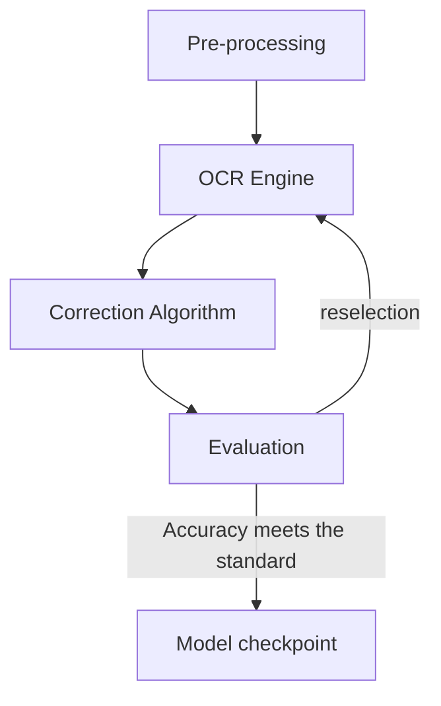
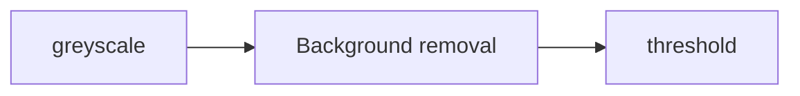

# Data+ 2022: AI-powered Historical Text Transcription

## Introduction

The Rubenstein Library holds millions of pages of handwritten documents ranging from ancient Papyri to records of Southern plantations to 21st century letters and diaries. Only a small subset of these documents have been digitized and made available online, and even fewer have been transcribed. The lack of text transcripts for handwritten documents impairs discovery and use of the materials, and prohibits any kind of computational text analysis that might support new avenues of research, including research related to the histories of racial injustice.
  
  While Optical Character Recognition (OCR) technology has made it possible to derive machine-readable text from typewritten documents in an automated way for several decades, the work of transcribing handwritten documents remains largely manual and labor-intensive. In the last few years, however, platforms like Transkribus have sought to harness the power of machine-learning by using Handwriting Text Recognition (HTR) to extract text from manuscripts and other handwritten documents held in libraries and archives. To date, the Rubenstein Library has conducted a few small-scale HTR experiments with mixed (and mostly disappointing) results. We have a lot to learn about the viability of HTR for our collections and about how to incorporate HTR into our existing workflows.
  
  In this Data+ project, students will test the viability of AI-powered HTR for transcribing digitized handwritten documents in the Rubenstein library and make recommendations for how the library might incorporate HTR into existing workflows, projects, and interfaces. Source material will be drawn from the Duke Digital Collections and will initially focus on a subset of digitized 19th-20th century women’s travel diaries, but could also include yet-to-be digitized materials related to the early history of Duke such as sermons, diaries, and lecture notes of our institution’s first president, Braxton Craven. As we approach Duke’s centennial, HTR-generated transcripts of the Craven materials would help support the university’s ongoing investigation into its institutional connection to slavery.


## Machine-Learning Pipelines

Sample Workflow: 



## Pre-processing



```
def get_greyscale(image):
    return cv2.cvtColor(image, cv2.COLOR_BGR2GRAY)

def remove_noise(image):
    return cv2.bilateralFilter(image, 5, 75, 75)

def thresholding(image):
    return cv2.adaptiveThreshold(image, 255, cv2.ADAPTIVE_THRESH_GAUSSIAN_C, cv2.THRESH_BINARY, 15, 9)
```


## Symspell Algorithm

```
sym_spell = SymSpell(max_dictionary_edit_distance=2, prefix_length=7)
dictionary_path = pkg_resources.resource_filename(
    "symspellpy", "frequency_dictionary_en_82_765.txt"
)
bigram_path = pkg_resources.resource_filename(
    "symspellpy", "frequency_bigramdictionary_en_243_342.txt"
)
# term_index is the column of the term and count_index is the
# column of the term frequency
sym_spell.load_dictionary(dictionary_path, term_index=0, count_index=1)
sym_spell.load_bigram_dictionary(bigram_path, term_index=0, count_index=2)

# lookup suggestions for multi-word input strings (supports compound
# splitting & merging)
file = open(r"")
content = file.read()

# max edit distance per lookup (per single word, not per whole input string)
suggestions = sym_spell.lookup_compound(content, max_edit_distance=2, transfer_casing=True)

result_after = ""
# display suggestion term, edit distance, and term frequency
for suggestion in suggestions:
    result_after += suggestion.term
```

```
Example:

Can yu readthis messa ge despite thehori    can you read this message despite the ho
ble sppelingmsitakes                        rrible spelling mistakes

```


## Four Available OCR Engine

image

 
## Transkribus

### Introducton

  Transkribus is a comprehensive platform for the digitisation, AI-powered text recognition, transcription and searching of historical documents – from any place, any time, and in any language. Visit the official [Transkribus](https://readcoop.eu/transkribus/?sc=Transkribus) website here. 

Strength
- extremely high accuracy in cursive hand written text recognition
- commercial product with mature software available

Weakness
- Low generalizability
- Not open-sourced, not replicable


### DataSet & Accuracy

|Training Set| [Jeremy Bentham Project] (https://www.ucl.ac.uk/bentham-project/) |
|Testing Set | Women Traveling Diaries | 
|Accuracy w/ symspell algorithm| CER:  1.84, WER:  5.56, Levenshtein distance:  96 [^2] |
|Accuracy w symspell algorithm | CER:  7.88, WER:  12.74, Levenshtein distance:  92 |

[^2]: The current lowest CER produced by the general HTR tool (support more than cursive handwriting) in the industry is around 2.75%.


## Tesseract

### Introducton

  Tesseract was originally developed at Hewlett-Packard Laboratories Bristol and at Hewlett-Packard Co, Greeley Colorado between 1985 and 1994, with some more changes made in 1996 to port to Windows, and some C++izing in 1998. In 2005 Tesseract was open sourced by HP. From 2006 until November 2018 it was developed by Google. Visit [Tesseract](https://github.com/tesseract-ocr/tesseract) repository here.

Strength
- Extremely high accuracy in recognizing a majority of printed fonts
- Various line segmentation & Recognition mode
- High Generalizability
- Tesseract comes with a python wrapper class called [Pytesseract] (https://pypi.org/project/pytesseract/)
- Support training

Weakness
- extremely tenuous training process (using shell scripts), nearly inable to train
- training is based on lines (segemented files paired up with ground-truth)
- Inable to recognize cursive fonts, accuracy changes correspondent with cursiveness. 

### DataSet & Accuracy

|Training Set | [tessdata_fast & tessdata_best] (https://github.com/tesseract-ocr/tessdata)|
|Testing Set | Women Traveling Diaries|


| Font type | Author | Accuracy |
| --------- | ------ | -------- |
| Non-cursive | N/A  | 98% |
| Cursive | N/A | 10% |
| Cursive | Crawford, Martha | 10% |
| Cursive | McMillan, Mary | 10% |
| Cursive | Harriet, Sanderson | 10% |


## Kraken

### Introducton

kraken is a turn-key OCR system optimized for historical and non-Latin script material.kraken's main features are: Fully trainable layout analysis and character recognition; Right-to-Left, BiDi, and Top-to-Bottom script support; ALTO, PageXML, abbyXML, and hOCR output; Word bounding boxes and character cuts; Multi-script recognition support; Public repository of model files; Lightweight model files; Variable recognition network architectures. Visit the official [Kraken](https://kraken.re/master/index.html) website here. 

### DataSet & Accuracy

|Training Set|[IAM Handwriting Database](https://fki.tic.heia-fr.ch/databases/iam-handwriting-database)|
|Testing Set|Women traveling diaries / IAM database|

 Strength
 - Easily Trainable [^1], training is based on pages
 - Modular design, usable line segmentation tools
 
 
 Weakness
 - Lack maintenance
 - require MacOS/linux operating system
 - Long training period
 
 
 [^1]: The training Set of all the OCR Engines require highly consistent and legible hand-written documents, which can provide high quality ground-truth files. Joined-up writing documents are relatively harder to train. 


## Google Cloud Vision OCR

### Introducton


### Data & Accuracy

|Training Set|N/A|
|Testing Set|Women traveling diaries|
|Accuracy w/ symspell algorithm|CER:  28.69, WER:  46.77, Levenshtein distance:  80|
|Accuracy w symspell algorithm|CER:  31.43, WER:  49.45, Levenshtein distance:  78|


## Future Analysis


